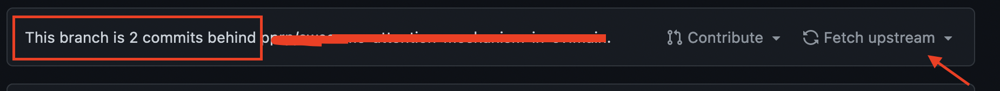

# jkdk

## 郑州大学健康打卡自动脚本

---

### 使用必读

项目**时常更新**。如果你发现用该项目时原先能打上卡但是现在打不上卡了，可以看看项目是否更新没。一般会及时更新。

也就是说如果出现下图情况，在红框内有commits behind了，就需要点击右边的fetch upstream进行更新了。

---

目前发现打卡界面记录**IP地址**，不过仍能打卡成功，尚不清楚有何影响。请谨慎使用。

---

### 1. 注意：项目启用后60天无更新时，Actions功能会**自动关闭**，届时需要再次手动开启。

---

### 2. 原先的微信接口失效了，现已更换新的微信接口，见最下面。

---

### 3. __**2022.4.11日更新**__ ~~因接口更新，简单的post方式可能会很麻烦，可能学校后台一周变次token。**重构代码**计划提前😭~~

---

### 4.  __**2022.4.12日更新**__ ~~**悲报**：学校一天换一次token。得换种方式了。 **重构代码**计划提前😭~~

---

## 使用方法

1. 先把代码整个都clone下来，然后在此基础上自己创建一个github仓库，仓库设置为私人。或者把代码fork到你自己的仓库（不过这样改不了仓库的可见性为私人）

2. 点击settings，找到Secrets

3. 添加5个仓库密钥 username、password、province、city、position，分别表示学号、密码、省份、城市和具体位置

   

   

   - 添加学号，name必须是username
   - 密码的添加同理，但name必须是password
   - 添加省份，省份的name必须是province，value是参考

     https://gist.github.com/mayufo/4207ed3fa925e6b3df7559832af85165
     是所对应数字的前两位

   - 城市的name必须是city，value是上面链接对应数字的第三、四位
   - 详细地址就没有要求，但是name必须是position

4. 然后在左边的找到actions，选择enable action，这样就激活了action
5. 结束。接下来会每日6点、6点10分和7点、7点10分自动打卡（多次打卡防止打卡失败）。不过这里**第一次**建议自己修改 .github/workflows 里面的 jkdk.yml 里的时间以进行一次打卡看看效果（有时候会因为网络问题打卡失败，不过因为设置了**多次打卡**的缘故，失败的几率会降低），注意修改为**UTC时间**，即比北京时间晚8个小时，具体可以参考有北京时间注释的那一行。

---

## 添加微信通知的方法

### 原先微信接口已经失效，替换为新的微信接口

### 使用方法

1. 扫描此微信二维码并关注微信公众号
[二维码](http://wxpusher.zjiecode.com/api/qrcode/hNHQXsGvGguORhwBHItWlaqUYvs79Ii59RpFN5YmuDIBOiO8YLQlqHd051TBfmeO.jpg)

2. 关注后在右下角”我的“这一栏中把UID替换到原先secrets中的微信key中即可，除此之外，关注后会有消息通知uid的值。
